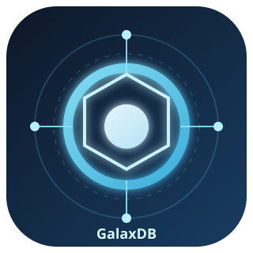

<div align="center">
  
  <h1>GalaxDB</h1>
  <p><strong>The AI-native database. One system for structured data, vector search, and training exports.</strong></p>

  [](https://github.com/zentrix-innovative-labs/galaxdb/actions/workflows/ci.yml)
  [](LICENSE)
  [](https://pypi.org/project/galaxdb)
</div>

---

## What is GalaxDB?

GalaxDB replaces the 5-service stack that most AI applications bolt together today:

| What you have today | GalaxDB |
|---|---|
| PostgreSQL + pgvector | ✅ SQL engine + HNSW vector index |
| Pinecone / Weaviate | ✅ `SEMANTIC_MATCH` in SQL, no separate service |
| OpenAI embeddings API | ✅ Local model via built-in sidecar, no API cost |
| S3 + Airflow pipeline | ✅ `CREATE VERSION TAG FOR TRAINING` → Lance dataset |
| Redis cache | ✅ NUMA-aware buffer pool inside the engine |

One connection string. One backup. One monitoring endpoint. PostgreSQL wire protocol — your existing `psycopg2`, `SQLAlchemy`, and `pg` code works unchanged.

---

## Quick start

### Embedded mode (no server, like SQLite)

```bash
pip install galaxdb
```

```python
import galaxdb

db = galaxdb.Database("./mydata")

db.execute("""
    CREATE TABLE docs (
        id   INT PRIMARY KEY,
        text TEXT EMBEDDING MODEL 'sentence-transformers/all-MiniLM-L6-v2' DIM 384
    )
""")

db.execute("INSERT INTO docs (id, text) VALUES (1, 'machine learning is great')")
db.execute("INSERT INTO docs (id, text) VALUES (2, 'rust programming language')")

# Semantic search — no separate vector DB, no API call
results = db.execute(
    "SELECT id, text FROM docs WHERE SEMANTIC_MATCH(text, 'neural networks', 0.7)"
)

# Export a training dataset — one SQL command
db.execute("CREATE VERSION TAG 'v1' FOR TRAINING WITH TRAINING PRECISION 'float32'")
path = db.training_dataset("v1")          # → Lance format, ready for PyTorch
```

### Server mode (multi-client, like PostgreSQL)

```bash
# Download the binary for your platform from GitHub Releases, then:
./galaxdb-server --data-dir /data --port 5433
```

```python
import galaxdb

conn = galaxdb.connect("host=localhost port=5433 dbname=galaxdb sslmode=disable")
conn.execute("SELECT id, text FROM docs WHERE SEMANTIC_MATCH(text, 'AI', 0.8)")
```

Any PostgreSQL client works — `psycopg2`, `SQLAlchemy`, `tokio-postgres`, `pg` (Node.js), JDBC.

---

## AuroraSQL — SQL extensions for AI

GalaxDB extends standard SQL with AI-native primitives:

```sql
-- Semantic search with similarity threshold
SELECT id, title
FROM articles
WHERE SEMANTIC_MATCH(title, 'climate change policy', 0.75)
  AND published_at > '2024-01-01';

-- Time-travel query
SELECT * FROM docs AT VERSION 'training-v1';

-- Near-duplicate deduplication
SELECT * FROM docs WHERE NOT DUPLICATE;

-- Training export
CREATE VERSION TAG 'train-v2'
  FOR TRAINING
  WITH TRAINING PRECISION 'sq8'
  TRAINING SEED 42;

-- Bulk insert
BULK INSERT INTO docs (id, text) VALUES
  (1, 'first document'),
  (2, 'second document');
```

---

## How it compares

| Feature | GalaxDB | PostgreSQL + pgvector | Pinecone | Weaviate |
|---|---|---|---|---|
| SQL queries | ✅ Full AuroraSQL | ✅ Standard SQL | ❌ | Partial |
| Vector search | ✅ HNSW built-in | ⚠️ pgvector (slow) | ✅ | ✅ |
| Embeddings | ✅ Local model | ❌ External API | ❌ External API | ✅ |
| Time-travel | ✅ `AT VERSION` | ❌ | ❌ | ❌ |
| Training export | ✅ Lance format | ❌ | ❌ | ❌ |
| Near-dedup | ✅ MinHash LSH | ❌ | ❌ | ❌ |
| Wire protocol | PostgreSQL | PostgreSQL | REST | REST/gRPC |
| Embedded mode | ✅ (like SQLite) | ❌ | ❌ | ❌ |
| Self-hosted | ✅ | ✅ | ❌ | ✅ |

**HNSW recall@10 on SIFT-1M:** 0.990 at ef=200, p99 616 µs  
**740 Rust tests passing, 7 chaos scenarios in 10.9 s** — confirmed on AWS c6id.4xlarge release build.  
*(see [BENCHMARKS.md](docs/BENCHMARKS.md) for full numbers)*

---

## Architecture

```
Your application
      │
      │  PostgreSQL wire protocol (port 5433)
      │  or Python embedded API
      ▼
┌─────────────────────────────────────────────────────┐
│                   galaxdb-server                    │
│                                                     │
│  SQL Parser → Query Planner → Executor              │
│       │                           │                 │
│  ART index    HNSW graph    LSM storage engine      │
│  (point reads) (vector search) (WAL + PAX blocks)   │
│                                                     │
│  ┌──────────────────┐   HTTP :9090                  │
│  │ galaxdb-sidecar  │   /health  /metrics           │
│  │ (child process)  │                               │
│  │ ONNX model       │                               │
│  │ Unix socket      │                               │
│  └──────────────────┘                               │
└─────────────────────────────────────────────────────┘
```

The sidecar is spawned automatically by the server — you don't manage it separately.

---

## Installation

### Python (embedded + remote)

```bash
pip install galaxdb
```

Requires Python 3.9+. Pre-built wheels for Linux x86-64/ARM64, macOS Intel/Apple Silicon, Windows x86-64.

### Binary (server mode)

Download from [GitHub Releases](https://github.com/zentrix-innovative-labs/galaxdb/releases):

```bash
# Linux x86-64
curl -L https://github.com/zentrix-innovative-labs/galaxdb/releases/latest/download/galaxdb-server-linux-x86_64 \
  -o galaxdb-server && chmod +x galaxdb-server

./galaxdb-server --data-dir /data --port 5433
```

### Docker

```bash
docker run -p 5433:5433 -p 9090:9090 -v /data:/data \
  zentrix/galaxdb:latest --data-dir /data
```

### Rust (embed in your application)

```toml
[dependencies]
galaxdb-embedded = "1.0.0-beta"
```

---

## Use cases

**RAG applications** — store documents, compute embeddings locally, query with `SEMANTIC_MATCH` filtered by metadata. No Pinecone, no OpenAI embeddings API.

**ML training pipelines** — `CREATE VERSION TAG ... FOR TRAINING` snapshots your data at a point in time and exports it as a Lance dataset. Load directly into PyTorch with zero-copy memory mapping.

**Hybrid search** — combine SQL filters with vector similarity in a single query. No application-side join between two systems.

**Audit-safe AI** — `AT VERSION` queries let you reproduce exactly what data a model was trained on. EU AI Act compliance built in.

---

## Observability

Every server instance exposes:

- `GET /health` — JSON status with subsystem health (disk, sidecar, connections)
- `GET /metrics` — Prometheus text format with 12 gauges/counters

```bash
curl http://localhost:9090/health
# {"status":"ok","version":"1.0.0-beta","subsystems":{"disk_full":false,"sidecar_healthy":true,"connections_active":3}}

curl http://localhost:9090/metrics
# galaxdb_connections_active 3
# galaxdb_wal_write_latency_us 42
# galaxdb_hnsw_recall_estimate_bp 9902
# ...
```

---

## Documentation

- [SQL Reference](docs/sql-reference.md) — full AuroraSQL syntax
- [Storage Engine](docs/STORAGE_ENGINE.md) — LSM tree, WAL, PAX blocks, HNSW
- [Benchmarks](docs/BENCHMARKS.md) — SIFT-1M recall, write throughput, latency

---

## Contributing

See [CONTRIBUTING.md](CONTRIBUTING.md). The short version: open an issue first for large changes, all PRs must pass the full test suite and three CI gates.

---

## License

Apache 2.0 — see [LICENSE](LICENSE).

---

<div align="center">
  <sub>Built by <a href="https://zentrix.ai">Zentrix Innovative Labs</a></sub>
</div>
